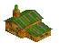
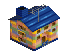
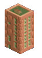

# Wannaroo Tourist Set

NewGRF for OpenTTD - Tourist industries

1. About

    Tourist industries for OpenTTD, inspired by WhiteHand's tourist set and tourist-accepting houses in ECS Houses, Swedish Houses, FIRS 3 Hotel.

1. Compatibility

    Compatibility with any newgrf is not guaranteed. No warranties are expressed or implied. Not tested with OpenTTD versions < 1.7.2.

    Not valid for Toyland.

    New cargo Tourists (TOUR) uses cargo id 31.

1. Features

    * 3 new tourist industries:
        * Hotel: produces tourists; accepts tourists, food, alcohol :wine_glass:
        * Visitor Center: produces and accepts tourists. Visitor Centers vary in appearance depending on climate/location but functionality is the same.
        * Town Square: produces tourists; accepts tourists, goods, alcohol :beers:

    * 4 houses:
        * 2 houses (rustic, regular) produce 8 +/- 3 tourists per production tick
            * Rustic House: 
            * Regular House: 
        * 2 tall buildings (tower block, flats) produce 20 +/- 4 tourists per production tick
            * Tower Block: 
            * Flats: 
        * max 1 each per town

    * Parameters
        * Hopefully are self-explanatory

1. Development

    The usual pnml/nml files with C includes and macros. I built this newgrf on Linux Mint 19.3 using gcc version 7.5.0, NML version 0.4.5.

1. License

    GPL v2

1. Credits

    Author of this newgrf: jrook1445 (https://github.com/jrook1445)

    Source code: https://github.com/jrook1445/wannaroo-tourist-set

    Credit and Acknowledgements (with sincere thanks and appreciation):

    OpenGFX: re-use of base set sprites: all contributors/developers as listed in 6.0 Credits, https://github.com/OpenTTD/OpenGFX/blob/master/README.md

    FIRS 3: cargo icons: andythenorth et. al. as listed in credits.txt, http://bundles.openttdcoop.org/firs/releases/3.0.12/credits.txt

    smallmines: ideas for production callbacks: Sylf, https://dev.openttdcoop.org/projects/smallmines

    OpenGFX+ Industries 0.3.5: ideas for C macros and industry location checks: Ingo von Borstel (aka planetmaker) et. al. as listed in readme.ptxt, https://dev.openttdcoop.org/projects/ogfx-industries/repository/entry/docs/readme.ptxt

    ECS industry extension: ideas for C macros and industry location checks: Maciej Czapkiewicz (aka McZapkie), https://dev.openttdcoop.org/projects/ecs-industry-extension

    NML and NFO: with many thanks to all the developers/contributors of NML, NFO, and the documentation/newgrf spec website at https://newgrf-specs.tt-wiki.net/wiki/Main_Page

    Inspiration: WhiteHand's tourist set, ECS Houses, Swedish Houses, FIRS 3 Hotel

:peace_symbol:

